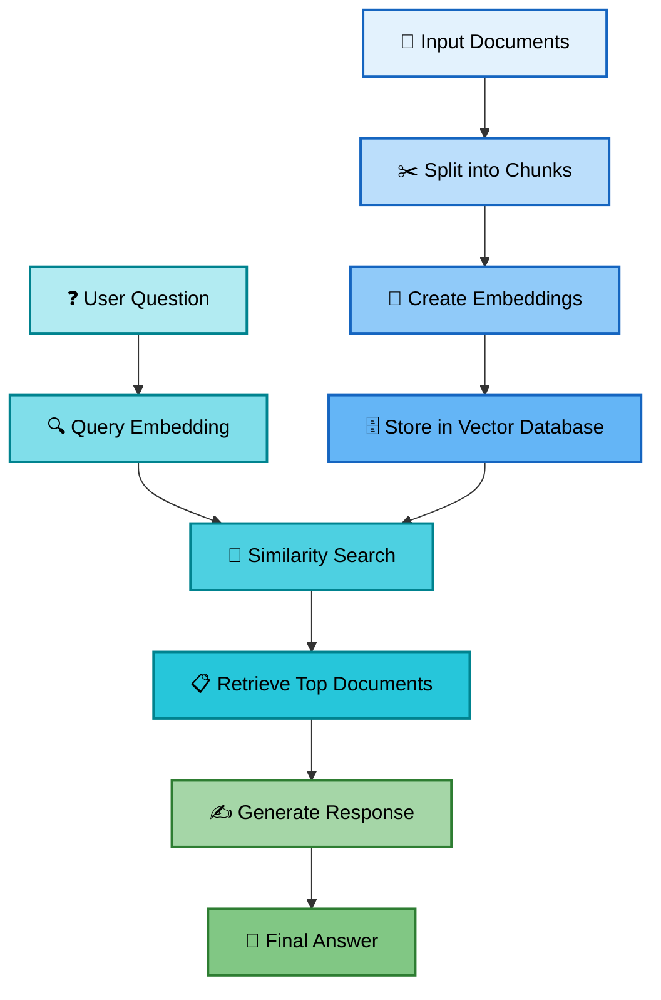

# 📖 RAG Knowledge Base

## � RAG Visual Flow Diagram

---

## 🔄 How RAG Differs from Traditional QA

| Feature | Traditional LLM QA | RAG |
|---------|-------------------|-----|
| **Knowledge Source** | Fixed training data | Dynamic external documents |
| **Information Freshness** | Outdated after training | Always current |
| **Accuracy** | Can hallucinate facts | Grounded in real documents |
| **Domain Specificity** | Generic knowledge | Custom knowledge bases |
| **Transparency** | Black box responses | Can cite sources |
| **Cost to Update** | Expensive retraining | Just update documents |
| **Privacy** | Data sent to model | Can run locally |

**Key Advantage:** RAG combines the reasoning power of LLMs with the factual accuracy of retrieval systems, giving you the best of both worlds.

---

## 🎯 Advanced RAG Techniques

### 1. Hierarchical RAG
- First find relevant documents, then find relevant chunks
- Better for large document collections

### 2. Conversational RAG
- Remember conversation history
- Ask clarifying questions
- Maintain context across multiple questions

### 3. Multi-Modal RAG
- Include images, charts, and tables
- Extract text from images with OCR
- Handle structured data like spreadsheets

---

## �️ Popular RAG Tools & Frameworks

### Production-Ready Frameworks

**1. LangChain** - Most popular framework with extensive integrations for document loaders, vector stores, and LLMs

**2. LlamaIndex** - Specialized for building search and retrieval applications with advanced indexing strategies

**3. Haystack** - Production-focused framework by deepset with strong pipeline orchestration

**4. AutoGen** - Microsoft's framework for building multi-agent conversational systems with RAG capabilities

### Vector Databases

**1. Pinecone** - Managed vector database with excellent performance and scalability

**2. Weaviate** - Open-source vector database with built-in ML models

**3. Chroma** - Lightweight, open-source embedding database perfect for prototyping

**4. Qdrant** - High-performance vector search engine with advanced filtering

**5. FAISS** - Facebook's library for efficient similarity search (used in this tutorial)

### Embedding Models

**1. OpenAI Embeddings** - High-quality, paid embeddings via API

**2. Sentence Transformers** - Free, open-source models from Hugging Face

**3. Cohere Embeddings** - Multilingual embeddings with strong performance

---

## ⚠️ Common Pitfalls & Best Practices

### Pitfalls to Avoid

❌ **Chunk Size Issues**
- Too large: Irrelevant info dilutes context
- Too small: Lose important context
- **Fix:** Start with 500-1000 characters, adjust based on your data

❌ **Poor Retrieval Quality**
- Using wrong similarity metric
- Not enough retrieved documents
- **Fix:** Retrieve top 3-5 docs, experiment with cosine vs. L2 distance

❌ **Ignoring Metadata**
- Missing document source, date, author
- **Fix:** Always store metadata with embeddings for better filtering

❌ **Not Testing Retrieval Separately**
- Assuming retrieval works without verification
- **Fix:** Test retrieval independently before adding generation

❌ **Overloading Context Window**
- Sending too much retrieved text to the LLM
- **Fix:** Summarize or re-rank retrieved docs before generation

### Best Practices

✅ **Hybrid Search** - Combine semantic (embeddings) with keyword search for best results

✅ **Re-ranking** - Use a cross-encoder to re-rank retrieved documents for better relevance

✅ **Cite Sources** - Always include source references in generated responses

✅ **Evaluation Metrics** - Track retrieval precision, answer accuracy, and latency

✅ **Incremental Updates** - Design your system to add new documents without full reprocessing

✅ **Prompt Engineering** - Craft clear instructions: "Based on the context provided, answer..."

✅ **Caching** - Cache embeddings and frequent queries to reduce costs and improve speed

---

## �📚 Resources & Further Reading

### Essential Books 📖

**1. "Hands-On Machine Learning" by Aurélien Géron**
   - Great for understanding the ML fundamentals behind RAG

**2. "Natural Language Processing with Python" by Steven Bird**
   - Deep dive into text processing techniques

**3. "Building LLM Applications for Production" by Valentine Malykh**
   - Production-ready AI systems

### Research Papers 📄

**1. "Retrieval-Augmented Generation for Knowledge-Intensive NLP Tasks" (Lewis et al., 2020)**
   - The original RAG paper from Meta AI
   - Link: https://arxiv.org/abs/2005.11401

**2. "REALM: Retrieval-Augmented Language Model Pre-Training" (Guu et al., 2020)**
   - Google's approach to retrieval-augmented pre-training
   - Link: https://arxiv.org/abs/2002.08909

**3. "Dense Passage Retrieval for Open-Domain Question Answering" (Karpukhin et al., 2020)**
   - Foundation for modern retrieval systems
   - Link: https://arxiv.org/abs/2004.04906

### Blogs & Tutorials 📝

**1. LangChain Documentation**
   - Comprehensive guides and examples
   - Link: https://python.langchain.com/docs/use_cases/question_answering/

**2. Pinecone Learning Center**
   - Practical RAG tutorials and best practices
   - Link: https://www.pinecone.io/learn/retrieval-augmented-generation/

**3. Hugging Face NLP Course**
   - Free course covering embeddings and retrieval
   - Link: https://huggingface.co/learn/nlp-course/

### Video Resources 🎥

**1. "Building Production-Ready RAG Applications" by LangChain**
   - Practical implementation strategies

**2. "Advanced RAG Techniques" by Weaviate**
   - Covers hybrid search, re-ranking, and optimization

**3. "RAG from Scratch" by DeepLearning.AI**
   - Step-by-step video series

### Tools & Playgrounds 🔧

**1. LangChain Templates** - Pre-built RAG applications
   - Link: https://github.com/langchain-ai/langchain/tree/master/templates

**2. LlamaIndex Examples** - Collection of RAG patterns
   - Link: https://github.com/run-llama/llama_index

**3. Hugging Face Spaces** - Interactive RAG demos
   - Link: https://huggingface.co/spaces (search "RAG")

---

## Contributing

This tutorial is open source and we'd love your help making it better!

### How to Contribute 🌟

**1. Found a bug?**
   - Open an issue describing the problem
   - Include code snippets and error messages
   - Tell us your system details (OS, Python version, etc.)

**2. Have an improvement idea?**
   - Fork this repository
   - Make your changes
   - Submit a pull request with a clear description

**3. Want to add content?**
   - New exercises and examples are always welcome
   - Additional troubleshooting tips
   - Support for more file types or libraries

### Contribution Guidelines 📋
- Keep the beginner-friendly tone
- Test your code before submitting
- Add comments and explanations
- Update this README if you add new features

---

## ❓ FAQ

### General Questions

**Q: Do I need expensive hardware or cloud services?**
- **A:** No! This tutorial is designed to run on regular laptops. We use lightweight models that work on CPU.

**Q: How much Python knowledge do I need?**
- **A:** Basic Python is helpful, but we explain everything step by step. If you can run a Python script, you're good to go!

**Q: Can I use this for commercial projects?**
- **A:** Yes! The MIT license allows commercial use. Just be aware of the licenses of the models you use.

**Q: Is this better than ChatGPT?**
- **A:** Different! ChatGPT is more general, but RAG can answer questions about YOUR specific documents and data.

### Technical Questions

**Q: Why do we chunk documents?**
- **A:** Language models have limits on how much text they can process at once. Chunking also improves retrieval precision.

**Q: What's the difference between embeddings and keywords?**
- **A:** Keywords look for exact matches. Embeddings understand meaning, so "car" and "vehicle" are treated as similar.

**Q: Can I use different language models?**
- **A:** Absolutely! You can swap in GPT-4, Claude, or any other model. Just change the generator component.

**Q: How do I handle different languages?**
- **A:** Use multilingual embedding models like "paraphrase-multilingual-MiniLM-L12-v2" and ensure your generator supports your target language.

### Troubleshooting Questions

**Q: I get "CUDA out of memory" errors. What do I do?**
- **A:** Use the CPU versions of libraries (faiss-cpu) and set device="cpu" in your models.

**Q: My answers are not relevant. How do I fix this?**
- **A:** Try smaller chunk sizes, check your similarity scores, and make sure your documents contain the information you're asking about.

**Q: The system is very slow. Any tips?**
- **A:** Use smaller models, process documents in batches, and consider using a proper vector database like ChromaDB for large collections.

**Q: Can I add new documents without reprocessing everything?**
- **A:** Yes! Just call `add_knowledge()` again with new content. The system will add to the existing knowledge base.

### Advanced Questions

**Q: How do I evaluate RAG performance?**
- **A:** Create test question-answer pairs and measure accuracy, relevance, and completeness. See our evaluation exercise above.

**Q: Can I combine RAG with fine-tuned models?**
- **A:** Yes! RAG retrieves information, fine-tuning teaches style and behavior. They complement each other well.

**Q: How do I handle contradictory information in documents?**
- **A:** Advanced RAG systems can detect and flag conflicts. For now, prioritize by source quality and recency.

**Q: What about privacy and security?**
- **A:** RAG runs locally with your documents. For sensitive data, avoid cloud-based models and use local alternatives.

---

[← Back to README](README.md) | [What is RAG?](what_is_RAG.md) | [Interactive Notebook](How_does_RAG_work.ipynb)