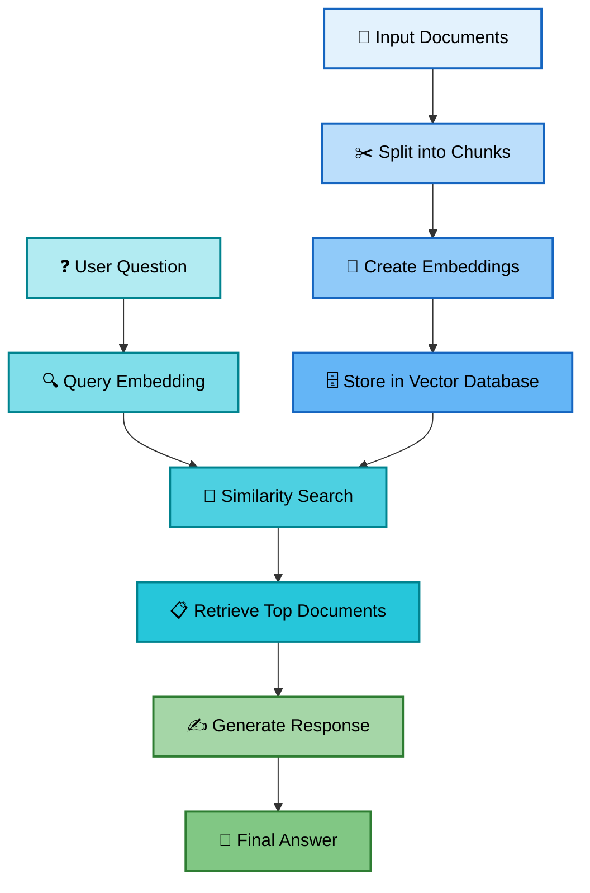

# 📖 RAG Knowledge Base

## 🔄 RAG Pipeline Overview

```
User Question → Retrieval System → Document Chunks → Generator → Final Answer
     ↑               ↓                    ↓              ↓
 [Question]    [Find Similar]     [Relevant Info]   [Human-like Response]
```

## 📊 Visual Flow Diagram



## 📋 ASCII Pipeline Diagrams

```
DOCUMENT PROCESSING PIPELINE:
┌─────────────┐    ┌──────────────┐    ┌─────────────┐    ┌──────────────┐
│   📄 Docs   │───▶│ Split Chunks │───▶│ Embeddings  │───▶│ Vector Store │
└─────────────┘    └──────────────┘    └─────────────┘    └──────────────┘

QUESTION ANSWERING PIPELINE:
┌─────────────┐    ┌──────────────┐    ┌─────────────┐    ┌──────────────┐
│❓ Question  │───▶│ Find Similar │───▶│ Get Context │───▶│✍️ Generate   │
└─────────────┘    └──────────────┘    └─────────────┘    └──────────────┘
                           ▲                                      │
                           │                                      ▼
                   ┌──────────────┐                      ┌──────────────┐
                   │ Vector Store │                      │💬 Final Answer│
                   └──────────────┘                      └──────────────┘
```

---

## 🎯 Advanced RAG Techniques

### 1. Hierarchical RAG
- First find relevant documents, then find relevant chunks
- Better for large document collections

### 2. Conversational RAG
- Remember conversation history
- Ask clarifying questions
- Maintain context across multiple questions

### 3. Multi-Modal RAG
- Include images, charts, and tables
- Extract text from images with OCR
- Handle structured data like spreadsheets

---

## 📚 Resources & Further Reading

### Essential Books 📖

**1. "Hands-On Machine Learning" by Aurélien Géron**
   - Great for understanding the ML fundamentals behind RAG

**2. "Natural Language Processing with Python" by Steven Bird**
   - Deep dive into text processing techniques

**3. "Building LLM Applications for Production" by Valentine Malykh**
   - Production-ready AI systems

---

## Contributing

This tutorial is open source and we'd love your help making it better!

### How to Contribute 🌟

**1. Found a bug?**
   - Open an issue describing the problem
   - Include code snippets and error messages
   - Tell us your system details (OS, Python version, etc.)

**2. Have an improvement idea?**
   - Fork this repository
   - Make your changes
   - Submit a pull request with a clear description

**3. Want to add content?**
   - New exercises and examples are always welcome
   - Additional troubleshooting tips
   - Support for more file types or libraries

### Contribution Guidelines 📋
- Keep the beginner-friendly tone
- Test your code before submitting
- Add comments and explanations
- Update this README if you add new features

---

## ❓ FAQ

### General Questions

**Q: Do I need expensive hardware or cloud services?**
- **A:** No! This tutorial is designed to run on regular laptops. We use lightweight models that work on CPU.

**Q: How much Python knowledge do I need?**
- **A:** Basic Python is helpful, but we explain everything step by step. If you can run a Python script, you're good to go!

**Q: Can I use this for commercial projects?**
- **A:** Yes! The MIT license allows commercial use. Just be aware of the licenses of the models you use.

**Q: Is this better than ChatGPT?**
- **A:** Different! ChatGPT is more general, but RAG can answer questions about YOUR specific documents and data.

### Technical Questions

**Q: Why do we chunk documents?**
- **A:** Language models have limits on how much text they can process at once. Chunking also improves retrieval precision.

**Q: What's the difference between embeddings and keywords?**
- **A:** Keywords look for exact matches. Embeddings understand meaning, so "car" and "vehicle" are treated as similar.

**Q: Can I use different language models?**
- **A:** Absolutely! You can swap in GPT-4, Claude, or any other model. Just change the generator component.

**Q: How do I handle different languages?**
- **A:** Use multilingual embedding models like "paraphrase-multilingual-MiniLM-L12-v2" and ensure your generator supports your target language.

### Troubleshooting Questions

**Q: I get "CUDA out of memory" errors. What do I do?**
- **A:** Use the CPU versions of libraries (faiss-cpu) and set device="cpu" in your models.

**Q: My answers are not relevant. How do I fix this?**
- **A:** Try smaller chunk sizes, check your similarity scores, and make sure your documents contain the information you're asking about.

**Q: The system is very slow. Any tips?**
- **A:** Use smaller models, process documents in batches, and consider using a proper vector database like ChromaDB for large collections.

**Q: Can I add new documents without reprocessing everything?**
- **A:** Yes! Just call `add_knowledge()` again with new content. The system will add to the existing knowledge base.

### Advanced Questions

**Q: How do I evaluate RAG performance?**
- **A:** Create test question-answer pairs and measure accuracy, relevance, and completeness. See our evaluation exercise above.

**Q: Can I combine RAG with fine-tuned models?**
- **A:** Yes! RAG retrieves information, fine-tuning teaches style and behavior. They complement each other well.

**Q: How do I handle contradictory information in documents?**
- **A:** Advanced RAG systems can detect and flag conflicts. For now, prioritize by source quality and recency.

**Q: What about privacy and security?**
- **A:** RAG runs locally with your documents. For sensitive data, avoid cloud-based models and use local alternatives.

---

[← Back to README](README.md) | [What is RAG?](what_is_RAG.md) | [Interactive Notebook](How_does_RAG_work.ipynb)