# RAG from Scratch

[](https://www.python.org/downloads/)
[](https://opensource.org/licenses/MIT)
[](https://github.com/Makilesh/RAG_Explained)

Ever wondered how ChatGPT could answer questions about *your* documents? That's [RAG](what_is_RAG.md). This tutorial breaks it down into simple, runnable code that actually works.

## Contents

- [Quick Start](#get-running)
- [See It in Action](#see-it-in-action)
- [Demo & Screenshots](#-demo--screenshots)
- [How to Use This Repo](#how-to-use-this-repo)
- [What Makes This Different](#what-makes-this-different)
- [RAG Pipeline Workflow](#-rag-pipeline-workflow)
- [The 5-Step Breakdown](#the-5-step-breakdown)
- [What is RAG?](#what-is-rag-really)
- [Resources](#issues-questions)

---

## The Files

- [`what_is_RAG.md`](what_is_RAG.md) - Start here if RAG is new to you
- [`How_does_RAG_work.ipynb`](How_does_RAG_work.ipynb) - Interactive notebook (run each cell)
- [`Complete_RAG_implementation.py`](Complete_RAG_implementation.py) - The full system (ready to run)
- [`knowledge.txt`](knowledge.txt) - Your test data
- [`RAG_knowledge.md`](RAG_knowledge.md) - Advanced stuff and FAQs

**Quick access:**
- 📖 [What is RAG?](what_is_RAG.md) - Start here for concepts
- 📓 [Step-by-step Notebook](How_does_RAG_work.ipynb) - Interactive learning
- 🚀 [Complete Implementation](Complete_RAG_implementation.py) - Production code
- 📚 [Advanced Guide](RAG_knowledge.md) - Deep dive & FAQs
- 📄 [Sample Data](knowledge.txt) - Test knowledge base

## Get Running

**Step 1:** Grab the code
```bash
git clone https://github.com/Makilesh/RAG_Explained.git
cd RAG_Explained
```

**Step 2:** Install stuff
```bash
python -m venv .venv
.venv\Scripts\activate          # Windows
source .venv/bin/activate       # Mac/Linux
pip install -r requirements.txt
```

**Step 3:** (Optional) Get a free Gemini API key
- Go to [Google AI Studio](https://aistudio.google.com/app/apikey)
- Copy `.env.example` to `.env` and paste your key
- Skip this if you want to run locally

**Step 4:** Run it
```bash
python Complete_RAG_implementation.py
```
Ask it: *"What do elephants use their trunks for?"*

## See It in Action

Here's what happens when you run it:

```bash
$ python Complete_RAG_implementation.py

✅ Loaded documents: 9 chunks

Enter your question: What do elephants use their trunks for?

🔎 Retrieved: Elephants use their trunks for smelling, breathing, trumpeting, drinking, and grabbing things.

📝 Augmented Prompt:
Based on this info: Elephants use their trunks for smelling, breathing, trumpeting, drinking, and grabbing things.
Answer the question: What do elephants use their trunks for?

Use Gemini API for generation? (y/n, default n): y

💡 Final Answer (Gemini):
Elephants use their trunks for smelling, breathing, trumpeting, drinking, and grabbing things.
```

## 📸 Demo & Screenshots

<!-- 
TO ADD YOUR CONTENT:
1. Record a demo video and upload to YouTube/Loom
2. Replace the placeholder link below with your video URL
3. Take screenshots of your RAG system running
4. Add images to the repo and replace the placeholder paths below
-->

### 🎥 Video Demo

> **Coming Soon:** Watch the RAG system in action!  
> <!-- Replace this with: [](your-video-url) -->

### 📷 Screenshots

**RAG System in Action**
<!-- Add your screenshot here -->

*The complete RAG pipeline processing a query*

**Example Query & Response**
<!-- Add your screenshot here -->

*Sample question about elephants with retrieved context and generated answer*

**Interactive Notebook**
<!-- Add your screenshot here -->

*Step-by-step execution in the Jupyter notebook*

---

## How to Use This Repo

**Never touched RAG before?**  
Read [`what_is_RAG.md`](what_is_RAG.md) → Open [`How_does_RAG_work.ipynb`](How_does_RAG_work.ipynb) → Run each cell and watch what happens

**Just want to see it work?**  
Run [`Complete_RAG_implementation.py`](Complete_RAG_implementation.py) right now. It works out of the box.

**Building something real?**  
Check [`RAG_knowledge.md`](RAG_knowledge.md) for production tips, common pitfalls, and how to scale.

## What Makes This Different

No fluff. No 500-line enterprise boilerplate. Just:
- **Real code** that runs in 5 minutes
- **Actual explanations** of why each line exists
- **Works offline** (uses local models if you skip the API)
- **Your choice:** Gemini API for quality, or free local model

Built with: LangChain, FAISS, Sentence Transformers, Google Gemini

## 🔄 RAG Pipeline Workflow

Here's how the magic happens - visualized:

```mermaid
flowchart TD
    A[📄 Step 1: Ingest<br/>Load Documents] --> B[🔢 Step 2: Embed<br/>Convert to Vectors]
    B --> C[🔍 Step 3: Retrieve<br/>Find Relevant Chunks]
    C --> D[➕ Step 4: Augment<br/>Combine Question + Context]
    D --> E[✨ Step 5: Generate<br/>LLM Response]
    
    style A fill:#e1f5ff,stroke:#01579b,stroke-width:2px
    style B fill:#f3e5f5,stroke:#4a148c,stroke-width:2px
    style C fill:#fff3e0,stroke:#e65100,stroke-width:2px
    style D fill:#e8f5e9,stroke:#1b5e20,stroke-width:2px
    style E fill:#fce4ec,stroke:#880e4f,stroke-width:2px
```



## The 5-Step Breakdown

This is what RAG actually does:

1. **Ingest** → Load your documents (PDFs, text files, whatever)
2. **Embed** → Turn text into numbers (so computers can compare them)
3. **Retrieve** → Find the most relevant chunks for your question
4. **Augment** → Combine your question with the retrieved info
5. **Generate** → Let an LLM write a proper answer

Each step has its own section in the notebook with runnable code.

## Try These Questions

Once you're running, ask:
- "What do elephants use their trunks for?"
- "Tell me about honey"
- Or add your own docs to [`knowledge.txt`](knowledge.txt) and ask about those

## What is RAG, Really?

> 💡 **[Full explanation in what_is_RAG.md →](what_is_RAG.md)**

You know how ChatGPT sometimes makes stuff up? RAG fixes that by letting it "look up" answers in your documents before responding.

**Without RAG:** LLM guesses based on training data  
**With RAG:** LLM reads your actual documents, then answers

It's like giving someone an open-book exam instead of making them memorize everything.

## Issues? Questions?

Open an issue. I actually read them.

Or fork it and make it better. That works too.

If this helped you build something, drop a star ⭐ 

**Resources that helped build this:**
- [LangChain Docs](https://python.langchain.com/)
- [FAISS on GitHub](https://github.com/facebookresearch/faiss)
- [Gemini API](https://ai.google.dev/)
- [Sentence Transformers](https://www.sbert.net/)
