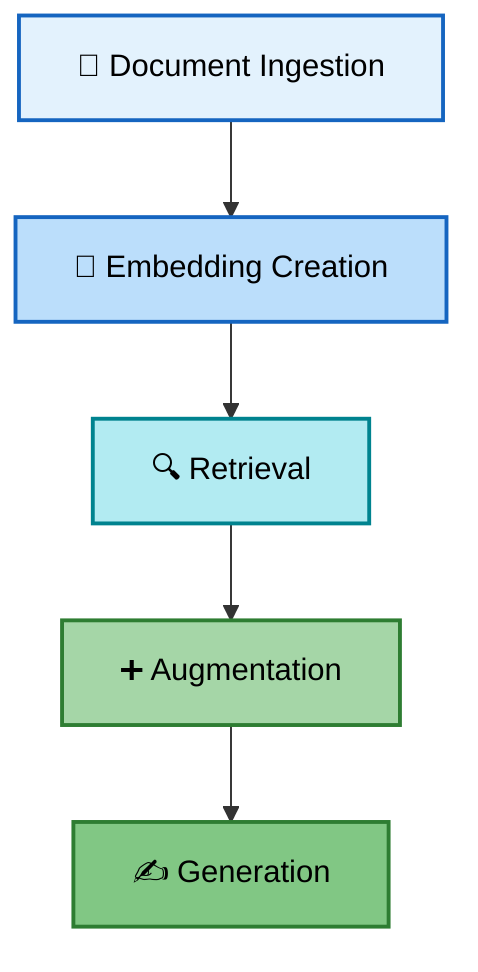

# Retrieval-Augmented Generation (RAG)

Think of RAG as giving a chatbot an open textbook during an exam.
Instead of relying only on the knowledge it was trained on (which may be outdated or incomplete), the chatbot can look up current and accurate information before answering your question.

**In short:** RAG enhances LLM responses by retrieving relevant information from external knowledge sources (like vector databases, PDFs, or websites) and then using that context to generate accurate, up-to-date answers.

---

## The Three Core Concepts

RAG involves three fundamental steps:

**1. Retrieval** → Finds relevant information from an external knowledge source based on the user's query

**2. Augmentation** → The retrieved information is combined with the original user query to create an enhanced LLM prompt

**3. Generation** → The LLM processes the augmented prompt and generates a response that is more accurate and contextually relevant

---


## How RAG Actually Works: The 5-Step Pipeline

While RAG has three core concepts, the implementation involves five detailed steps:



1. **Document Ingestion** - Load your source materials (like PDFs, text files, or knowledge bases) into the system

2. **Embedding Creation** - Convert each document into dense vector representations (embeddings) which capture semantic meaning

3. **Retrieval** - Search for the most relevant documents based on a user's question

4. **Augmentation** - Combine the user's question with the retrieved information to create a powerful prompt

5. **Generation** - Pass the augmented prompt to a language model, which produces a clear and accurate answer

---

## Why is RAG Important?


**Improves Accuracy** - Pulls real facts from your data sources, reducing hallucinations (made-up answers)

**Highly Flexible** - Works with any set of documents (company manuals, research papers, or personal notes)

**More Reliable** - Combines the reasoning power of LLMs with the factual strength of external knowledge

**Cost-Effective** - Update knowledge by simply adding documents instead of expensive model retraining

**Privacy-Friendly** - Run locally with your sensitive data without sending it to external APIs

### Key Challenges RAG Solves

**The Hallucination Problem** - LLMs often "make things up." RAG grounds responses in real documents

**Knowledge Cutoffs** - Models stop at a certain training date. RAG enables access to recent information

**Private Data Access** - RAG allows integration with your own custom datasets that weren't in the model's training data

**Expensive Model Updates** - Instead of costly retraining, you just update the knowledge base documents

---

## Common Use Cases

- **Customer Support Bots** - Answer questions using company documentation
- **Research Assistants** - Query through academic papers and reports
- **Enterprise Search** - Find information across company knowledge bases
- **Content Creation** - Generate articles based on source materials

*Want to explore more advanced applications? Check out [RAG_knowledge.md](RAG_knowledge.md#-common-rag-use-cases)*

---

## Real-World Example: RAG in Action

Let's see how RAG handles a question about company policies:

**User asks:** "What are the company vacation policies?"

**Step 1 - Retrieval:** System searches the knowledge base and finds the HR manual section:
```
"Employees receive 15 vacation days per year. Unused days can be rolled over 
to the next year, up to a maximum of 5 days. Requests must be submitted 2 
weeks in advance."
```

**Step 2 - Augmentation:** The system creates an enhanced prompt:
```
Based on the following context, answer the question accurately:

Context: [Retrieved HR policy text]

Question: What are the company vacation policies?
```

**Step 3 - Generation:** The LLM produces a clear, accurate answer:
```
"According to company policy, employees get 15 vacation days annually. You can 
roll over up to 5 unused days to next year. Remember to submit requests at 
least 2 weeks ahead!"
```

**Result:** Factual, company-specific answer grounded in real documents!

---

## Next Steps

Ready to try it yourself?

1. 📓 **[Run the Interactive Notebook](How_does_RAG_work.ipynb)** - Learn by doing, step-by-step
2. 🚀 **[See the Complete Code](Complete_RAG_implementation.py)** - Production-ready implementation
3. 📚 **[Explore Advanced Topics](RAG_knowledge.md)** - Deep dive into optimization and scaling

[← Back to README](README.md)