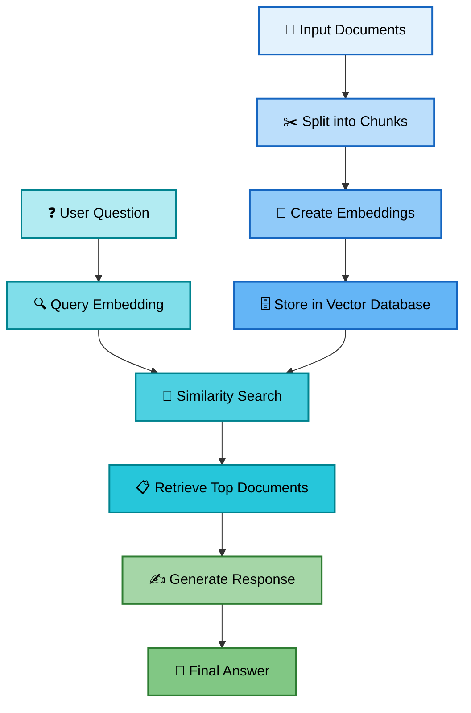
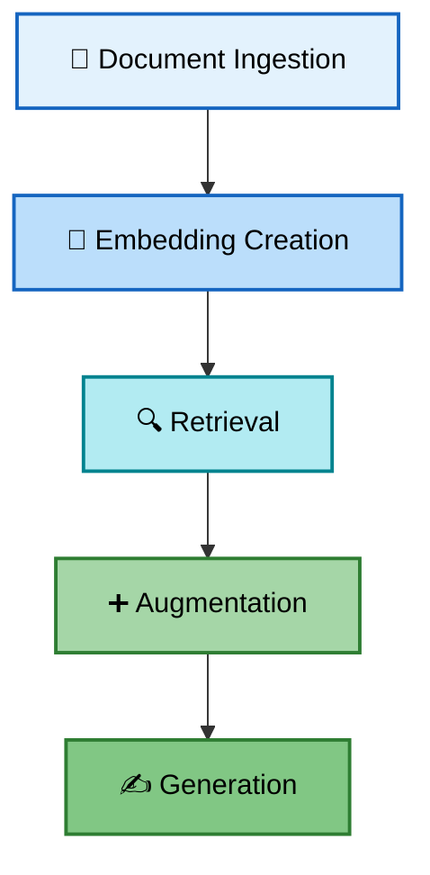

# Retrieval-Augmented Generation (RAG)

Think of RAG as giving a chatbot an open textbook during an exam.
Instead of relying only on the knowledge it was trained on (which may be outdated or incomplete), the chatbot can look up current and accurate information before answering your question.

**In short:** RAG enhances LLM responses by retrieving relevant information from external knowledge sources (like vector databases, PDFs, or websites) and then using that context to generate accurate, up-to-date answers.

---

## The Three Core Concepts

RAG involves three fundamental steps:

**1. Retrieval** → Finds relevant information from an external knowledge source based on the user's query

**2. Augmentation** → The retrieved information is combined with the original user query to create an enhanced LLM prompt

**3. Generation** → The LLM processes the augmented prompt and generates a response that is more accurate and contextually relevant

---

## 📊 RAG Visual Flow Diagram

---

## How RAG Actually Works: The 5-Step Pipeline

While RAG has three core concepts, the implementation involves five detailed steps:

1. **Document Ingestion** - Load your source materials (like PDFs, text files, or knowledge bases) into the system

2. **Embedding Creation** - Convert each document into dense vector representations (embeddings) which capture semantic meaning

3. **Retrieval** - Search for the most relevant documents based on a user's question

4. **Augmentation** - Combine the user's question with the retrieved information to create a powerful prompt

5. **Generation** - Pass the augmented prompt to a language model, which produces a clear and accurate answer

---

## Why is RAG Important?

* Improves Accuracy: Pulls real facts from your data sources, reducing hallucinations (made-up answers).

* Highly Flexible: Works with any set of documents (e.g., company manuals, research papers, or personal notes).

* More Reliable: Combines the reasoning power of LLMs with the factual strength of external knowledge.

### Challenges RAG Helps With

* The Hallucination Problem: LLMs often “make things up.” RAG grounds responses in real documents

* Knowledge Cutoffs: Models stop at a certain training date. RAG enables access to recent information.

* No Access to Private Information: RAG allows integration with your own custom datasets.

* Expensive Updates: Instead of retraining, you just update the knowledge base.

* Greater data security:

* Access to current domain-specific data

* Cost-efficient AI implementation and AI scaling

* Scalability

* Bias and Noise

## RAG Use Cases

* **Specialized Chatbots & Virtual Assistants** - Customer support with company-specific knowledge

* **Research & Analysis** - Query large document collections instantly

* **Content Generation** - Create content grounded in specific sources

* **Market Analysis & Product Development** - Analyze documents for insights

* **Knowledge Engines** - Enterprise search with intelligent answers

* **Recommendation Services** - Personalized suggestions based on data

---

## How RAG Works: Step-by-Step Example

1. **User submits a prompt:**
    What are the company vacation policies?

2. **Retrieval system queries:**
    Searches the knowledge base

3. **Relevant info returns:**
    Finds HR policy sections

4. **RAG creates augmented prompt:**
    Combines question with context

5. **LLM generates output:**
    Answers based on policy docs

6. **User receives accurate answer:**
    Factual, company-grounded

---

## Next Steps

Ready to try it yourself?

1. 📓 **[Run the Interactive Notebook](How_does_RAG_work.ipynb)** - Learn by doing, step-by-step
2. 🚀 **[See the Complete Code](Complete_RAG_implementation.py)** - Production-ready implementation
3. 📚 **[Explore Advanced Topics](RAG_knowledge.md)** - Deep dive into optimization and scaling

[← Back to README](README.md)